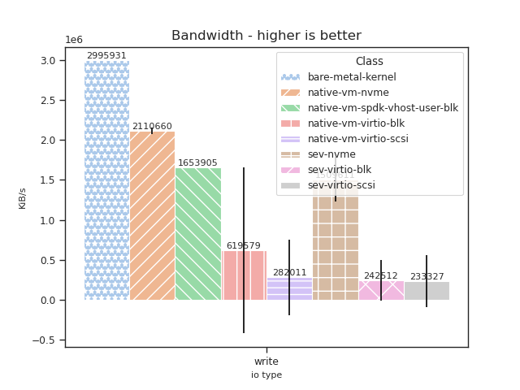
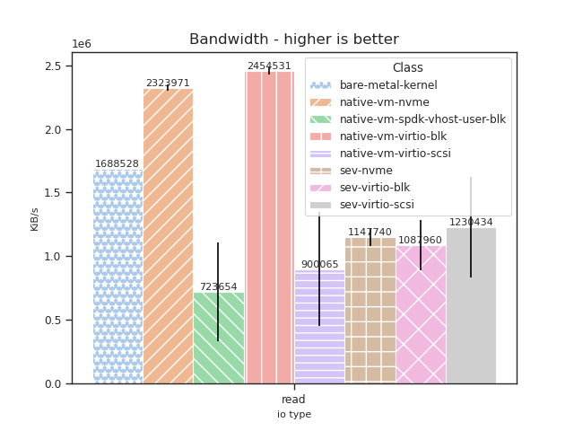
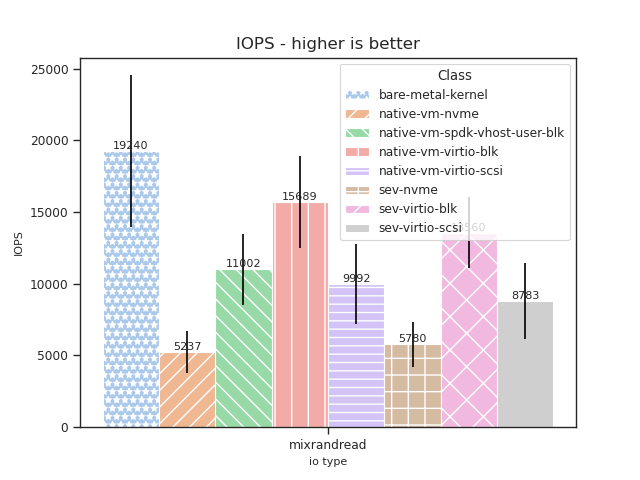
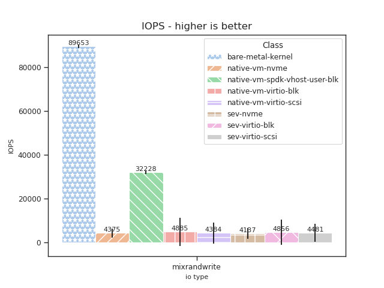
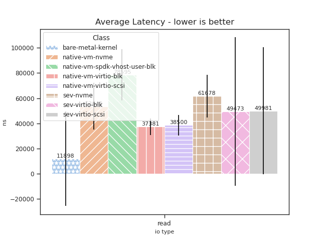
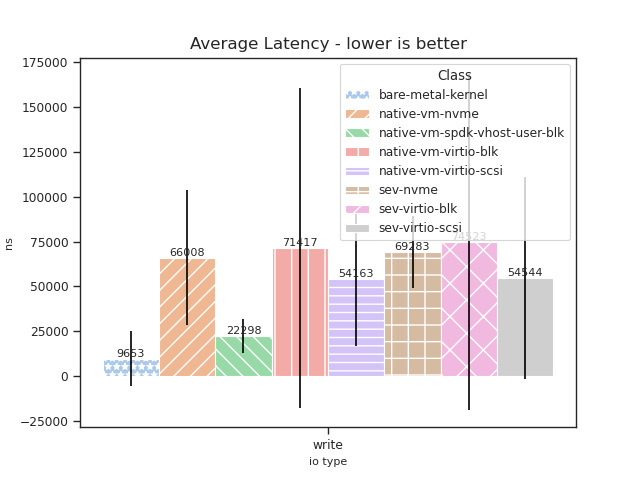
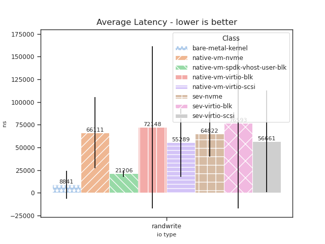

# Benchmark Results

## Config

### `fio` configuration

We execute the benchmarks with the following `fio` configurations, as in [Spool (ATC'20)](https://www.usenix.org/conference/atc20/presentation/xue):


#### Global `fio` setup

##### Bandwidth

```ini
[global]
bs=128K
iodepth=128
numjobs=1
filename=/nvme/a
direct=1
size=1G
loops=1
```


##### IOPS

```ini
[global]
bs=4K
iodepth=32
numjobs=4
filename=/nvme/a
direct=1
size=1G
loops=1
```

##### Average Latency

```ini
[global]
bs=4K
iodepth=1
numjobs=1
filename=/nvme/a
direct=1
size=1G
loops=1
```


### Environment Setup

| ---------    | ---------                                                                                                                                                  |
| Host CPU     | `AMD EPYC 7713P 64-Cores`                                                                                                                                  |
| Host Memory  | `HMAA8GR7AJR4N-XN (Hynix) 3200MHz 64 GB x 8 (512GB)`                                                                                                       |
| Host Kernel  | `6.3.0-rc2 \#1-NixOS SMP PREEMPT\_DYNAMIC (NixOS 23.05)} commit: [fea9b78](https://github.com/AMDESE/linux/tree/fea9b785bfa90e015c7d81526e36060da1bf01d1)` |
| QEMU         | `8.0.0 (AMD) (patched) commit: [a248931](https://github.com/AMDESE/qemu/tree/a248931547843b9edb0f3b0c7d6d0c76ffdf7659)`                                    |
| OVMF         | `Stable 202211 (patched) commit: [6598f62](https://github.com/AMDESE/ovmf/commit/6598f62bda4eb884c65d6c0aed7ede64258a41d8)`                                |
| Guest vCPUs  | 16                                                                                                                                                         |
| Guest Memory | 16GB                                                                                                                                                       |
| Guest Kernel | `5.19.0-41-generic #42-Ubuntu SMP PREEMPT_DYNAMIC (Ubuntu 22.10 )`                                                                                         |
| ---------    | ---------                                                                                                                                                  |


## Benchmark Results

### Bandwidth

#### Write




#### Read




### IOPS

#### Mix-Rand-Read



#### Mix-Rand-Write



#### Rand-Read


#### Rand-Write


### Average Latency

### Read



### Write



### Rand Read


### Rand Write



