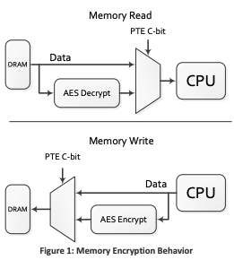

# GR - Evaluating Confidential Computing with Unikernels

## from zero to SEV-SNP

Confidential Computing started to become relevant in the last 10 years. In these years the way software is shipped in production changed radically, almost everyone now uses cloud providers (Google, Microsoft and Amazon), this leads to customers running their code on machines they don't own. It is logic that customers want to be sure no one can access their code, not other customers running vms on the same hardware, nor whoever is controlling the hypervisor (cloud vendor) or in worst case scenarios malign actors who compromised the physical machine. 
In some sectors it might be crucial that whoever is running our workloads has no access to our customer's data.

### demo attack to show how simple it is to read memory inside a vm if hypervisor is compromised or an human operator is acting maliciously

Let's demo a very simple attack, first of all we start two machines, `sev` and `nosev`, the former has SEV enabled, as we can check:

```bash
# this command is meant to be run inside the machine with SEV enabled
ubuntu@sev:~$ sudo dmesg | grep SEV
[   18.360846] Memory Encryption Features active: AMD SEV SEV-ES SEV-SNP
[   18.590902] SEV: Using SNP CPUID table, 31 entries present.
[   18.850633] SEV: SNP guest platform device initialized.
```

```bash
ubuntu@sev:~$ echo "hello from the SEV machine!" > sev.txt
ubuntu@sev:~$ cat sev.txt 
hello from the SEV machine!
```

```bash
ubuntu@nosev:~$ echo "hello from the NOSEV machine!" > nosev.txt
ubuntu@nosev:~$ cat nosev.txt 
hello from the NOSEV machine!
```

We now get the processe's PIDS: 

```bash
[nix-shell:~]$ ps -aux | grep qemu
root     3095337  1.0  0.2 20358396 1275848 pts/0 Sl+ 12:43   0:22 ./usr/local/bin/qemu-system-x86_64 -enable-kvm -cpu EPYC-v4,host-phys-bits=true -smp 16 -m 16G -machine type=q35 -drive if=pflash,format=raw,unit=0,file=/scratch/roberto/gr/usr/local/share/qemu/OVMF_CODE.fd,readonly=on -drive if=pflash,format=raw,unit=1,file=./nosev.fd -drive file=cloud-config-nosev.iso,media=cdrom,index=0 -drive file=nosev.img,if=none,id=disk0,format=raw -device virtio-scsi-pci,id=scsi0,disable-legacy=on,iommu_platform=true -device scsi-hd,drive=disk0 -nographic -monitor pty -monitor unix:monitor,server,nowait -netdev type=tap,script=no,downscript=no,id=net0,ifname=tap3 -device virtio-net-pci,mac=52:54:00:cc:62:03,netdev=net0,disable-legacy=on,iommu_platform=true,romfile=
root     3115638  7.8  3.2 19789772 16820448 pts/4 Sl+ 13:11   0:44 ./usr/local/bin/qemu-system-x86_64 -enable-kvm -cpu EPYC-v4,host-phys-bits=true -smp 16 -machine type=q35,confidential-guest-support=sev0,memory-backend=ram1,kvm-type=protected,vmport=off -object memory-backend-memfd-private,id=ram1,size=16G,share=true -object sev-snp-guest,id=sev0,policy=0x30000,cbitpos=51,reduced-phys-bits=1,init-flags=0,host-data=b2l3bmNvd3FuY21wbXA -drive if=pflash,format=raw,unit=0,file=/scratch/roberto/gr/OVMF_files/OVMF_CODE_sev.fd,readonly=on -drive if=pflash,format=raw,unit=1,file=./sev.fd -drive file=cloud-config-sev.iso,media=cdrom,index=0 -drive file=sev.img,if=none,id=disk0,format=raw -device virtio-scsi-pci,id=scsi0,disable-legacy=on,iommu_platform=true -device scsi-hd,drive=disk0 -nographic -monitor pty -monitor unix:monitor,server,nowait -netdev type=tap,script=no,downscript=no,id=net0,ifname=tap4 -device virtio-net-pci,mac=52:54:00:cc:62:04,netdev=net0,disable-legacy=on,iommu_platform=true,romfile=
roberto  3121836  0.0  0.0   6632  1828 pts/3    S+   13:20   0:00 grep qemu
```

Now we can dump the memory for the processes using `gcore`

```bash
[nix-shell:~]$ sudo gcore -o mem-dump 3115638
[nix-shell:~]$ grep -rnw mem-dump.3115638 -e "hello from the SEV machine!"
[nix-shell:~]$ 
```

```bash
[nix-shell:~]$ sudo gcore -o mem-dump 3095337
[nix-shell:~]$ grep -rnw mem-dump.3095337 -e "hello from the NOSEV machine!"
grep: mem-dump.3095337: binary file matches
```

Encryption  at rest (designed to prevent the attacker from accessing the unencrypted data by ensuring the data is encrypted when on disk from Microsoft, cite properly) has been around for a long time, but this leaves a big part of daily computing unencrypted, namely RAM and CPU registers, to tackle this issue major chip producers started to develop a technlogy to enable "confidential computing", namely AMD Secure Encrypted Virtualization (SEV) and Intel Trusted Domain Extensions (TDX). In this short article we try to understand a little more about AMD SEV, assuming nothing and getting our hands dirty step by step.


### AMD Secure Memory Encryption (SME)
AMD SME is the basic building block for the more sophisticated thing we'll cover later, so it might be beneficial to understand how it works. Memory operations are performed via dedicated hardware, an entirely different chip on die. AMD EPYC™ (soc microprocessor) introduced two hardware security components:

1. __AES-128 hardware e_ncryption engine__: embedded in memory controller, makes sure data to main memory is encrypted during write opeartions and decrypted during read operations, this memory controller is inside the EPYC SOC, so memory lines leaving the soc are encrypted
2. __AMD Secure Processor__: provides cryptographic functionality for secure key generation and key management



TSME IS CALLED  memory guard on ryzen pro
### AMD Secure Encrypyted Virtualization (SEV)
### AMD Secure Encrypted Virtualization-Encrypted State (SEV-ES)
### AMD Secure Encrypted Virtualization-Secure Nested Paging (SEV-SNP)
### AMD Secure Encrypted Virtualization-Secure Trusted I/O  (SEV-TIO)


### Launching a SEV machine with QEMU

## libvirt

What is libvirt? 

```bash
wget https://cloud-images.ubuntu.com/focal/current/jammy-server-cloudimg-amd64.img
sudo qemu-img convert jammy-server-cloudimg-amd64.img /var/lib/libvirt/images/sev.img
sudo cloud-localds /var/lib/libvirt/images/sev-cloud-config.iso config/cloud-config-sev.yml
```

```bash
sudo virt-install \
              --name sev \
              --memory 4096 \
              --memtune hard_limit=4563402 \
              --boot uefi \
              --os-variant ubuntu22.04 \
              --import \
              --controller type=scsi,model=virtio-scsi,driver.iommu=on \
              --controller type=virtio-serial,driver.iommu=on \
              --network network=default,model=virtio,driver.iommu=on \
              --memballoon driver.iommu=on \
              --graphics none \
              --launchSecurity sev,policy=0x07
```

## connect to the machine
23063879273
`sudo virsh -c qemu:///system console sev`

## delete the machine
```bash
sudo virsh -c qemu:///system undefine --nvram sev
sudo virsh -c qemu:///system destroy sev

#### OVMF
ok so apparently the ovmf fd stuff is something that contians the executable firmware and the non-volatile variable store,  we shall make a vm specific copy because the variable store 
should be private to each virtual machine

When launching a SEV machine like this I cannot enable SEV-SNP
I guess this is because it is not supported, 

```


### questions:
+ can we provide a demo of docker protected by SEV?

## References

+ https://www.amd.com/system/files/TechDocs/memory-encryption-white-paper.pdf
+ https://www.amd.com/system/files/techdocs/sev-snp-strengthening-vm-isolation-with-integrity-protection-and-more.pdf
+ https://documentation.suse.com/sles/15-SP1/html/SLES-amd-sev/art-amd-sev.html
+ https://help.ovhcloud.com/csm/en-dedicated-servers-amd-sme-sev?id=kb_article_view&sysparm_article=KB0044018
+ https://libvirt.org/kbase/launch_security_sev.html
+ https://documentation.suse.com/de-de/sles/15-SP4/html/SLES-all/article-amd-sev.html#table-guestpolicy
+ http://www.linux-kvm.org/downloads/lersek/ovmf-whitepaper-c770f8c.txt
+ https://www.qemu.org/docs/master/system/i386/amd-memory-encryption.html
+ https://cloud.google.com/docs/security/encryption/default-encryption
+ https://learn.microsoft.com/en-us/azure/security/fundamentals/encryption-atrest
+ https://docs.aws.amazon.com/whitepapers/latest/efs-encrypted-file-systems/encryption-of-data-at-rest.html
+ https://www.intel.com/content/www/us/en/developer/articles/technical/intel-trust-domain-extensions.html
+ https://www.amd.com/en/developer/sev.html
+ https://arch.cs.ucdavis.edu/assets/papers/ipdps21-hpc-tee-performance.pdf
+ https://cdrdv2.intel.com/v1/dl/getContent/690419 
+ https://www.amd.com/content/dam/amd/en/documents/developer/sev-tio-whitepaper.pdf
+ https://www.amd.com/system/files/TechDocs/58019-svsm-draft-specification.pdf
+ https://www.amd.com/content/dam/amd/en/documents/developer/58207-using-sev-with-amd-epyc-processors.pdf
+ https://www.amd.com/system/files/TechDocs/40332.pdf
+ https://www.amd.com/system/files/TechDocs/cloud-security-epyc-hardware-memory-encryption.pdf
+ https://www.youtube.com/watch?v=yPr7zYTXA7I